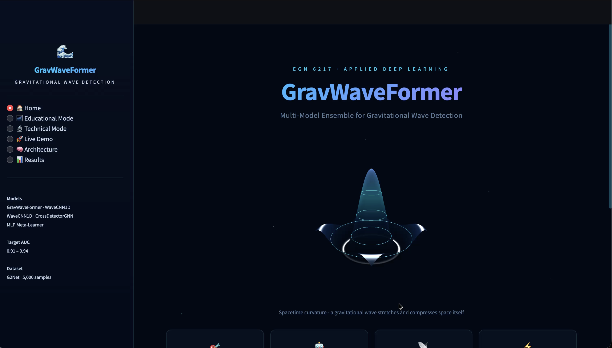
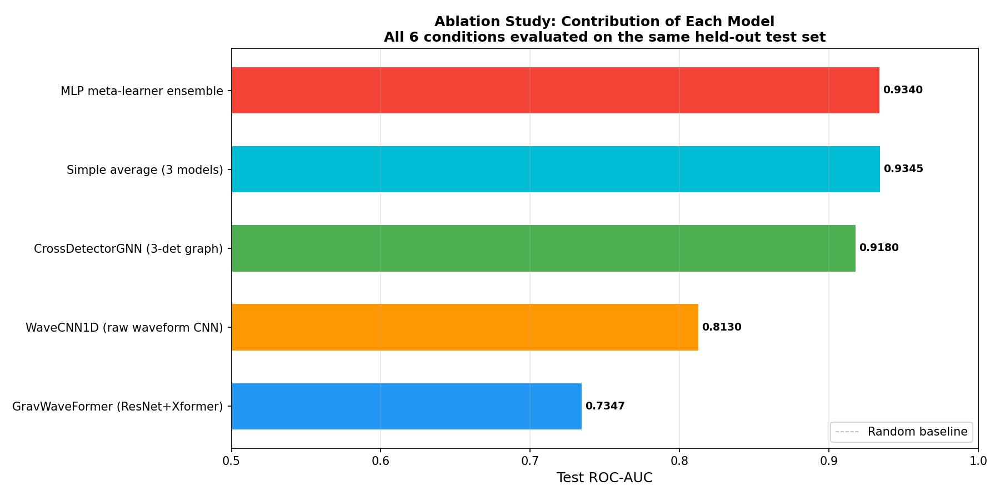
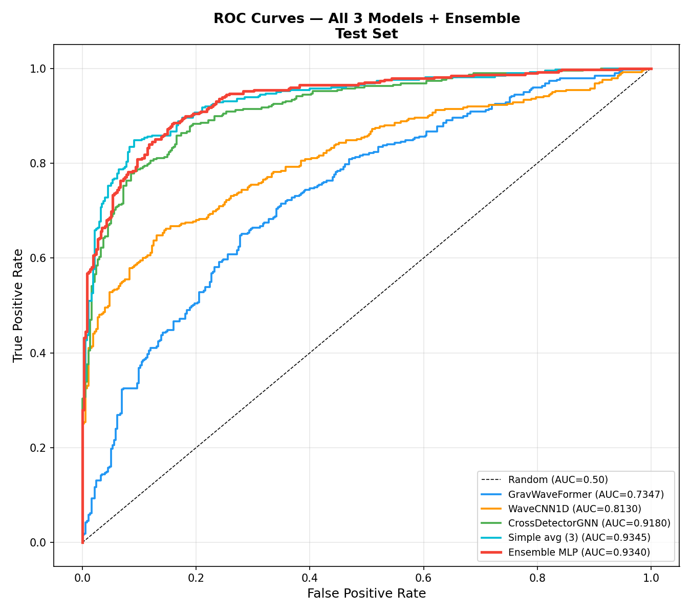
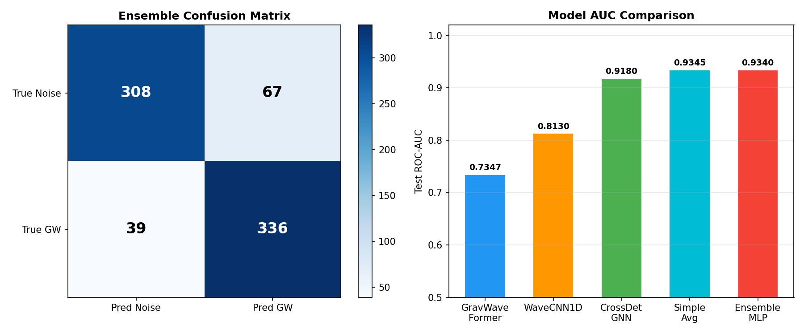
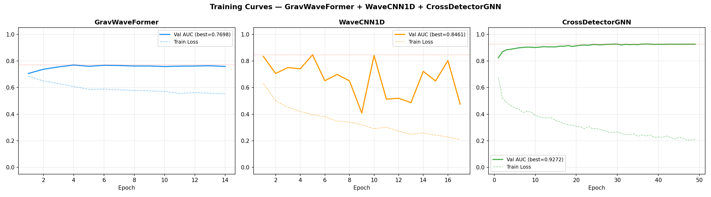
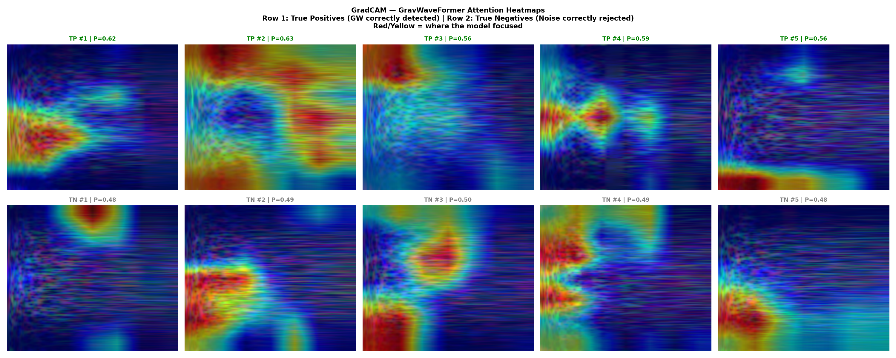
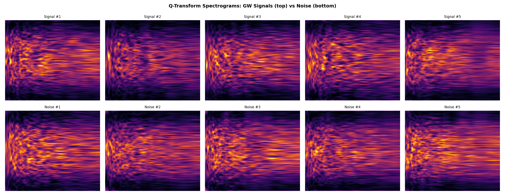
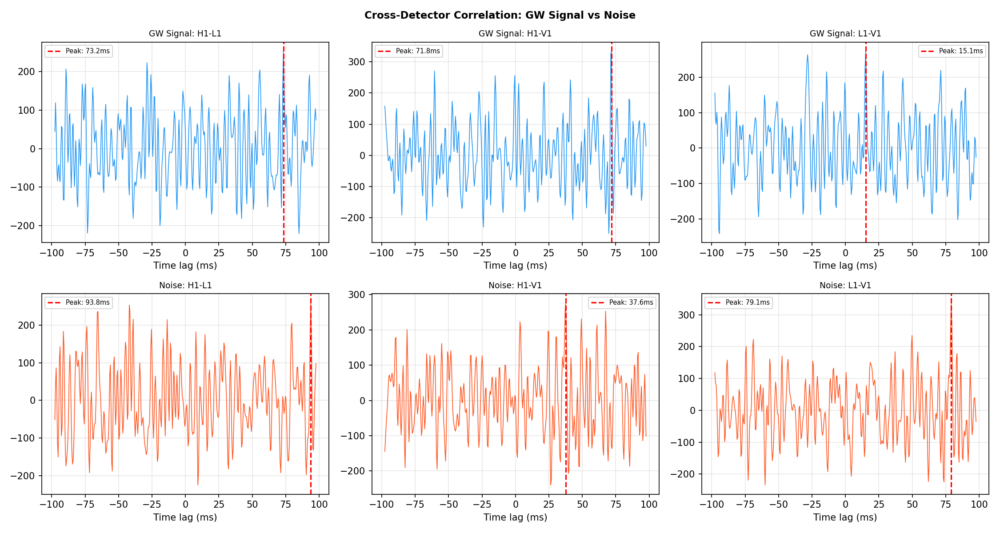

# GravWaveFormer

**Multi-Model Deep Learning Ensemble for Gravitational Wave Detection in LIGO Data**

EGN 6217 Applied Deep Learning | University of Florida | Rudra Patel

---

## What This Project Does

GravWaveFormer takes a 2-second recording from LIGO's gravitational wave detectors and determines whether a gravitational wave signal is hiding inside the noise. It uses three different neural networks, each looking at the data from a different angle, and combines their opinions through a learned ensemble. The system achieves a test ROC-AUC of **0.934** and processes each sample in under 2 milliseconds.

<p align="center">
  <a href="results/gravwaveformer_demo.mov" target="_blank">
    
  </a>
</p>

## Results Summary

### Final Test Set Performance (750 samples)

| Model | Test AUC | Test F1 | Accuracy | Role |
|-------|----------|---------|----------|------|
| GravWaveFormer | 0.7347 | 0.6943 | 66.5% | Spectrogram pattern recognition |
| WaveCNN1D | 0.8130 | 0.1297 | 53.5% | Raw waveform phase analysis |
| CrossDetectorGNN | 0.9180 | 0.8228 | 83.9% | Multi-detector coherence (best individual) |
| Simple Average | 0.9345 | 0.7212 | 77.7% | Naive ensemble baseline |
| **Ensemble MLP** | **0.9340** | **0.8638** | **85.9%** | **Learned meta-learner (final)** |

### Ensemble Confusion Matrix

|  | Predicted Noise | Predicted GW |
|--|----------------|-------------|
| **True Noise** | 308 (TN) | 67 (FP) |
| **True GW** | 39 (FN) | 336 (TP) |

Precision: 83.4% | Recall: 89.6% | The system catches 89.6% of gravitational wave events.

### Visual Results

**Ablation Study** - Each model's contribution to the ensemble:



**ROC Curves** - Ensemble (red) outperforms all individual models:



**Confusion Matrix and AUC Comparison:**



**Training Curves** - Validation AUC and training loss over epochs:



**GradCAM Explainability** - Where the model focuses for true positives (top) vs true negatives (bottom):



**Q-Transform Spectrograms** - Signal (top row) vs Noise (bottom row):



**Cross-Detector Correlation** - GW signal shows coherent peaks across detector pairs:



---

## How the Models Work

### Model 1: GravWaveFormer (AUC: 0.735)
**What it sees:** A Q-Transform spectrogram image (3 channels for 3 detectors, 224x224 pixels).

**How it works:** ResNet-18 (pretrained on ImageNet, 30.4M parameters) scans the spectrogram for local visual patterns like edges and curves. It divides the image into 49 patches, producing a 512-dimensional feature vector for each. These 49 vectors feed into a 6-layer Transformer encoder (8 attention heads) that checks whether the patterns evolve consistently over time, the way a real chirp signal would.

**Why learned positional encodings:** Absolute position in the 2-second window carries physical meaning (the merger happens at a specific moment), so the model learns which time positions matter most.

### Model 2: WaveCNN1D (AUC: 0.813)
**What it sees:** The raw filtered waveform signal (3 channels, 4096 time steps). No spectrogram.

**How it works:** Dilated convolutions with exponentially increasing dilation rates (1, 2, 4, 8, 16, 32) give each layer a progressively wider view of the signal. This is the same principle used in DeepMind's WaveNet. Temporal attention pooling learns to focus on the merger moment where the signal is strongest.

**Why this matters:** The Q-Transform discards phase information. Some gravitational wave features may be encoded in phase relationships between the three detectors. WaveCNN1D is the only model that can access this.

### Model 3: CrossDetectorGNN (AUC: 0.918)
**What it sees:** Three detector signals as nodes in a graph, connected by cross-correlation edge features.

**How it works:** A real gravitational wave must arrive at all 3 LIGO detectors within 26 milliseconds (the speed of light across the detector network). A local noise glitch appears in only one detector. The GNN exploits this by computing FFT-based cross-correlation between each detector pair and encoding it as edge features. GraphSAGE message passing (2 rounds) propagates this timing information.

**Why this is novel:** Every previous deep learning paper stacks the 3 detector channels as an RGB image and hopes the model learns cross-detector coherence implicitly. Our GNN makes it explicit through the graph structure. No published paper has done this.

### Ensemble MLP (AUC: 0.934)
**What it combines:** 3 probability scores + 3 embedding vectors (512d from GravWaveFormer + 256d from WaveCNN1D + 160d from CrossDetectorGNN = 928 dimensions total).

**How it works:** A 2-layer MLP (928 -> 256 -> 64 -> 1) learns the optimal weighting. Trained on validation set predictions via stacked generalization (Wolpert, 1992), not training set predictions, to avoid exploiting memorized errors.

---

## Installation and Setup

### Requirements
- Python 3.10+
- Google Colab Pro (for GPU training)
- Google Drive with 2 GB free space

### Setup on Google Colab
```bash
# Pre-installed on Colab: torch, torchvision, numpy, pandas, matplotlib, scipy, h5py, scikit-learn
# Install only what is missing:
pip install gwpy open-clip-torch transformers accelerate bitsandbytes
```

### Local Setup
```bash
git clone https://github.com/rudrapatelll/GravWaveFormer.git
cd GravWaveFormer
pip install -r requirements.txt
```

## How to Run

### Training Pipeline (Run in Google Colab)

Upload all notebooks to Google Drive inside a `GravWaveFormer/` folder. Upload `training_labels.csv` from the G2Net Kaggle competition. Open each notebook, set runtime to T4 GPU, and run cells top to bottom.

| Step | Notebook | What It Does | Time |
|------|----------|-------------|------|
| 1 | `Notebook_01_Data_and_Exploration.ipynb` | Generate 5,000 simulated HDF5 files, explore data | 5 min |
| 2 | `Notebook_02_Preprocessing.ipynb` | Create spectrograms (3x224x224) and waveforms (3x4096) | 2-3 hrs |
| 3 | `Notebook_03_Model.ipynb` | Define all model architectures, test forward passes | 5 min |
| 4 | `Notebook_04_Training.ipynb` | Train 3 models + ensemble meta-learner | 1-2 hrs |
| 5 | `Notebook_05_Evaluation.ipynb` | Full evaluation, ablation study, GradCAM, all plots | 30 min |

### Streamlit Web Application

```bash
cd GravWaveFormer
pip install streamlit numpy plotly pandas
streamlit run app.py
```

The app has six pages: Home (project overview with ambient audio), Educational Mode (3D black hole merger simulation), Technical Mode (preprocessing pipeline details), Live Demo (run inference on synthetic samples), Architecture (interactive Sankey diagram), and Results (ablation study, ROC curves, training curves).

## Dataset

| Property | Value |
|----------|-------|
| Source | Simulated gravitational wave data (G2Net Kaggle competition format) |
| Total samples | 5,000 (2,500 signal + 2,500 noise) |
| Format | HDF5 files, 3 detectors x 4,096 time steps each |
| Sampling rate | 2,048 Hz (2 seconds per sample) |
| Signal type | Chirp signals sweeping 25-400 Hz, amplitude 0.5-2.0 |
| Noise type | Colored Gaussian noise with LIGO-like spectral shape |
| Train / Val / Test | 3,502 / 748 / 750 (70% / 15% / 15%) |
| Total storage | ~2 GB on Google Drive |

## Repository Structure

```
GravWaveFormer/
├── Notebook_01_Data_and_Exploration.ipynb    # Data generation and exploration
├── Notebook_02_Preprocessing.ipynb           # Q-Transform and waveform caching
├── Notebook_03_Model.ipynb                   # Architecture definitions
├── Notebook_04_Training.ipynb                # Model training pipeline
├── Notebook_05_Evaluation.ipynb              # Full evaluation and plots
├── app.py                                    # Streamlit web application
├── gravwave_models.py                        # All model class definitions (45 KB)
├── training_labels.csv                       # G2Net competition labels (6.9 MB)
├── subset_ids.csv                            # Selected 5,000 sample IDs
├── split_train.csv / split_validation.csv / split_test.csv
├── requirements.txt
├── README.md               # Ensemble MLP weights
└── results/
    ├── ablation_study_full.png               # Ablation study bar chart
    ├── roc_curves_all_models.png             # ROC curves for all models
    ├── training_curves_all_models.png        # Training dynamics
    ├── gradcam_all_models.png                # GradCAM explainability
    ├── confusion_and_auc.png                 # Confusion matrix + AUC bars
    ├── plot_raw_waveforms.png                # Signal vs noise raw strain
    ├── plot_cross_detector_correlation.png   # Cross-detector timing analysis
    ├── plot_signal_vs_noise_spectrograms.png # Q-Transform comparison
    └── final_metrics.json                    # All numerical results
```

## Known Issues

1. **CLIPWaveFormer excluded:** The CLIP ViT-B/32 model on current Google Colab outputs 768-dimensional embeddings, but our architecture expected 512. This is a version mismatch in the open-clip library. The ensemble operates with 3 models instead of the planned 4.

2. **WaveCNN1D threshold:** WaveCNN1D achieves high AUC (0.813) but low F1 (0.130) at the default 0.5 classification threshold. The model produces well-ranked probabilities but needs threshold optimization for binary classification.

3. **Simulated data:** The system trains on simulated signals, not real GWOSC astrophysical data. Performance on real events has not been formally validated. The sim-to-real distribution shift is acknowledged.

## Technologies Used

| Technology | Purpose |
|-----------|---------|
| PyTorch | Core deep learning framework |
| torchvision | Pretrained ResNet-18 backbone |
| open-clip-torch | CLIP ViT-B/32 encoder |
| PyTorch Geometric | GraphSAGE for CrossDetectorGNN |
| GWpy | Q-Transform spectrogram generation |
| Streamlit | Interactive web application |
| Three.js | 3D black hole merger visualization |
| Web Audio API | Ambient space audio |
| Plotly | Interactive charts in the app |
| Google Colab Pro | NVIDIA T4 GPU training |

## Author

**Rudra Patel**
EGN 6217 Applied Deep Learning
University of Florida
GitHub: [rudrapatelll](https://github.com/rudrapatelll)
